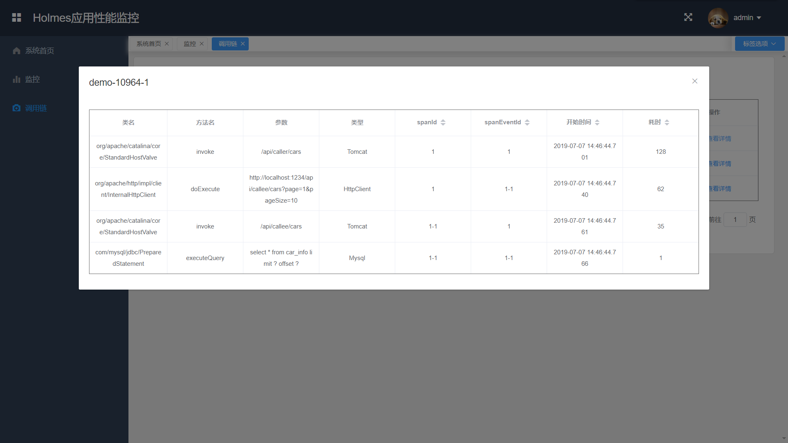
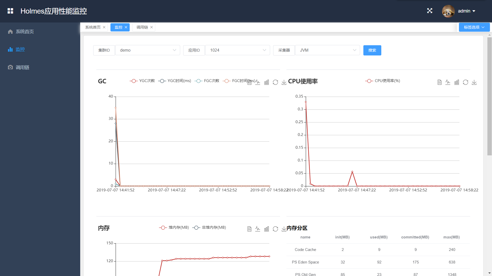

# holmes-java-agent #

<a href="http://lucene.apache.org/">
    
</a>
<a href="https://github.com/vuejs/vue">
    
</a>
<a href="https://github.com/ElemeFE/element">
    
</a>
<a href="https://github.com/Jeffery1993/holmes-java-agent/blob/master/LICENSE">
    
</a>
<a href="https://github.com/Jeffery1993/holmes-java-agent/releases">
    
</a>
  
Holmes-java-agent is a tool for java application performance monitoring, which is based on bytecode enhancement.

## Screenshots ##
### Trace ###


### Monitor ###


## Features ##
- [x] Non-invasive distributed-tracing and Java application performance monitor
- [x] No middle-wares are needed except JRE
- [x] A web page is developed for searching and visualization

## Tutorial ##
```
// unzip the downloaded package
unzip holmes-java-agent.zip
// goto the unzipped directory
cd holmes-java-agent
// start the server and visit "http://localhost:8080"
java -jar holmes-server.jar
// start the demo with agent and visit "http://localhost:1234/swagger-ui.html"
java -javaagent:holmes-agent.jar -DclusterId=demo -jar holmes-demo.jar
```

## Build ##
```
// clone the code
git clone https://github.com/Jeffery1993/holmes-java-agent.git
// goto the web module
cd holmes-java-agent/server/src/main/web
// install web dependencies
npm install
// build the web module
npm run build
// copy all the files from dist to resource directory
mv dist/* ../resources/common/static

// goto the root directory
cd holmes-java-agent
// build the whole project
mvn clean install
```
